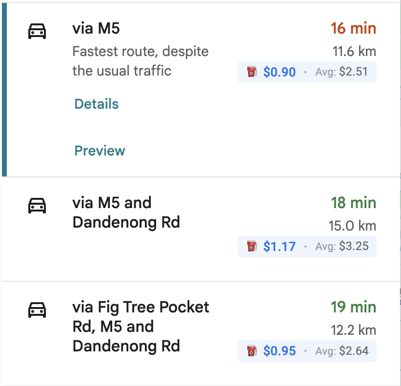
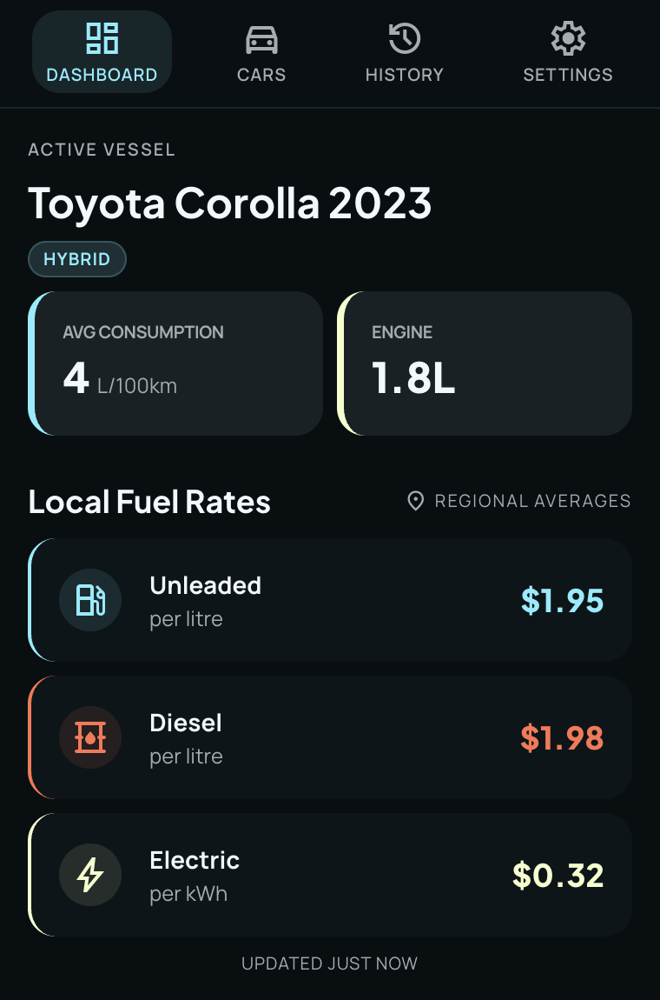

# Fuel Cost for Google Maps

A Chrome extension that shows how much your journey will cost in fuel, right inside Google Maps. No tab switching, no manual calculations. Pick your car, see the cost.



## What it does

When you plan a route on Google Maps, this extension reads the distance and calculates the fuel cost based on your car's efficiency and current fuel prices. The cost appears inline, next to the distance Google Maps already shows.

**Key features:**

- **Car lookup by name** — type "Corolla 2023 hybrid" and the extension finds the engine specs for you
- **Global coverage** — currency and fuel prices auto-detected for your region
- **Fleet management** — save up to 2 cars (free tier), switch between them from the dedicated Cars page, and always fall back to the built-in Average Car
- **Average car comparison** — see how your car stacks up against the fleet average
- **No manual fuel price entry** — per-country averages built in, refreshed daily
- **Trip history** — every calculated fuel cost is recorded locally so you can review past trips, total spend, and distance
- **Privacy-respecting analytics** — optional anonymous usage analytics via PostHog with a one-click opt-out in Settings



## For end users

### Install

1. Download or clone this repo
2. Run `pnpm install && pnpm build`
3. Open Chrome and go to `chrome://extensions`
4. Enable **Developer Mode** (top right)
5. Click **Load Unpacked** and select the `dist/` folder

The extension icon appears in your toolbar. Click it to set up your car, then navigate to Google Maps and plan a route — the fuel cost appears automatically. The popup uses a top navigation bar with four tabs: Dashboard, Cars, History, and Settings.

### First run

The extension works immediately with an "Average Car" profile based on your region's fleet average. To get accurate costs, click the extension icon and add your own car:

1. Open the **Cars** tab
2. Click **Register New Vehicle**
3. Type your car's name (e.g. "Ford Ranger 2022 diesel")
4. Pick the matching trim from the results
5. Your car is now active — fuel costs on Google Maps will use its efficiency

You can also enter specs manually if your car isn't in the database. The lookup database (CarQuery) covers models up to 2022 — for newer cars, use manual entry. To switch cars, go to the Cars tab and tap the check icon on any stored vehicle — including the built-in Average Car.

### Trip history

Every fuel cost the extension calculates is stored locally in your browser. Open the **History** tab to see:

- Total trips, distance, and cost
- A list of recent calculations with car name, distance, and cost
- A button to clear your history

No trip data leaves your device — it's stored in `chrome.storage.local`.

### Settings

- **Distance units** — km or miles
- **Fuel efficiency units** — L/100km, MPG, or kWh/100km
- **Currency** — AUD, USD, GBP, EUR, NZD, CAD, INR, JPY
- **Show average comparison** — display the average car cost alongside your car's cost
- **Fuel prices** — auto-detected per region, manually overridable
- **Disable anonymous analytics** — opt out of anonymous usage data collection

## For developers

### Prerequisites

- [Node.js 24+](https://nodejs.org/) (use [nvm](https://github.com/nvm-sh/nvm) — `.nvmrc` included)
- [pnpm](https://pnpm.io/)

### Setup

```bash
nvm use
pnpm install
```

### Scripts

| Command             | Description                         |
| ------------------- | ----------------------------------- |
| `pnpm dev`          | Start Vite dev server with HMR      |
| `pnpm build`        | Production build to `dist/`         |
| `pnpm test`         | Run unit tests (vitest)             |
| `pnpm test:watch`   | Run tests in watch mode             |
| `pnpm typecheck`    | TypeScript type checking            |
| `pnpm lint`         | ESLint (TypeScript + SolidJS rules) |
| `pnpm lint:fix`     | ESLint with auto-fix                |
| `pnpm format`       | Format all files with Prettier      |
| `pnpm format:check` | Check formatting without writing    |

### Loading in Chrome

1. Run `pnpm build` (or `pnpm dev` for HMR on the popup)
2. Go to `chrome://extensions`, enable Developer Mode
3. Click **Load Unpacked** and select the `dist/` folder
4. For content/background script changes, click the refresh icon on the extension card

### Analytics setup

The extension supports optional PostHog analytics. To enable it, create a `.env` file in the project root:

```env
VITE_POSTHOG_KEY=phc_your_key_here
VITE_POSTHOG_HOST=https://us.i.posthog.com
```

Without a PostHog key, all analytics calls are no-ops. Users can also disable analytics in the extension's Settings panel.

**Events tracked:** popup opens, car additions (manual vs lookup), search queries (length and result count only), settings changes, fuel cost calculations (bucketed distance ranges — no exact locations or PII).

### Tech stack

| Layer              | Technology                                                        |
| ------------------ | ----------------------------------------------------------------- |
| Build              | Vite + @crxjs/vite-plugin                                         |
| UI framework       | SolidJS                                                           |
| Styling            | Vanilla Extract (popup), plain CSS in Shadow DOM (content script) |
| Language           | TypeScript                                                        |
| Extension standard | Chrome Manifest V3                                                |
| Data fetching      | @tanstack/solid-query                                             |
| Testing            | Vitest + @solidjs/testing-library + @testing-library/jest-dom     |
| Local storage      | chrome.storage.sync (state), chrome.storage.local (trips, cache)  |
| Analytics          | PostHog (optional, with user opt-out)                             |
| Linting            | ESLint with typescript-eslint + eslint-plugin-solid               |
| Formatting         | Prettier                                                          |

### Project structure

```
src/
  popup/                  # Extension popup UI (SolidJS)
    components/           # Each component in its own directory
      NavBar/             # Top navigation (Dashboard, Cars, History, Settings)
      Home/               # Dashboard with active car stats and fuel prices
      Cars/               # Fleet management (active car, stored vehicles)
      CarSearch/           # Car lookup and add/edit flow
      TrimPicker/
      ManualEntry/
      Settings/
      TripHistory/
    styles/               # Vanilla Extract theme and global styles
  content/                # Content script injected into Google Maps
  background/             # Service worker for alarms and fuel price refresh
  utils/                  # Shared utilities (each in its own directory)
    analytics/            # PostHog analytics wrapper with opt-out
    calculator/           # Pure fuel cost calculation functions
    carLookup/            # CarQuery API integration (direct fetch)
    fuelPrices/           # Per-country fuel price data and caching
    storage/              # chrome.storage helpers
    tripHistory/          # Trip recording via chrome.storage.local
    types/                # Shared TypeScript interfaces
```

Tests are co-located as siblings (e.g. `calculator.test.ts` next to `calculator.ts`). Path aliases `@utils/*` and `@components/*` are configured in `tsconfig.json`, `vite.config.ts`, and `vitest.config.ts`.

## License

PolyForm Noncommercial License 1.0.0 — free for personal and noncommercial use. See [LICENSE](LICENSE) for details.
